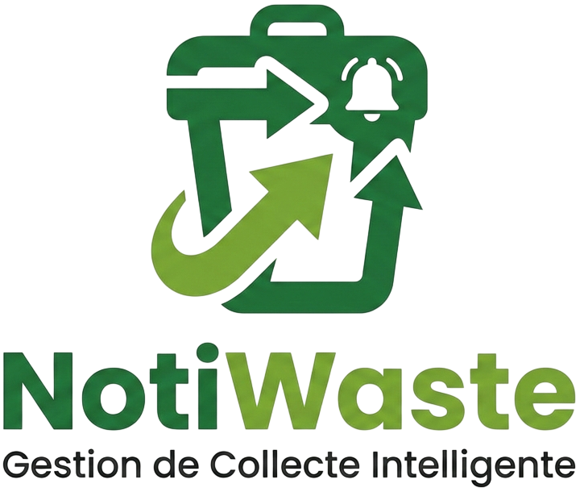

<p align="center">
  
</p>

# NotiWaste

Application mobile Flutter de gestion des collectes de déchets pour la commune de Sainte-Rose (La Réunion).

## Fonctionnalités

- **Calendrier interactif** — Affichage mensuel avec pastilles colorées par type de collecte
- **Lieux de dépôt CIREST** — Carte OpenStreetMap des points d'apport (ADEME), géolocalisation et itinéraires
- **Notifications automatiques** — Rappel la veille de chaque collecte (triple sécurité : zonedSchedule + AlarmManager + WorkManager)
- **Gestion des collectes** — Ajout/suppression de dates directement depuis l'app avec sauvegarde Firestore
- **Infos** — Guide, à propos et mentions légales regroupés dans un onglet
- **Synchronisation cloud** — Données stockées dans Firebase Firestore

## Types de collectes


| Couleur | Type                | Description                   |
| ------- | ------------------- | ----------------------------- |
| Gris    | Poubelle grise      | Ordures ménagères             |
| Jaune   | Poubelle jaune      | Collecte sélective (tri)      |
| Vert    | Déchets Verts       | Végétaux, tontes, branches    |
| Rouge   | Encombrants         | Meubles, appareils volumineux |
| Bleu    | Déchets Métalliques | Ferraille, métaux             |


## Installation

```bash
# Cloner le projet
git clone https://github.com/votre-repo/collecte_dechets_app.git
cd app-notiwaste

# Installer les dépendances
flutter pub get

# Configurer les clés Firebase (voir section ci-dessous)
cp .env.example.json .env.json
# → Remplir .env.json avec vos clés Firebase

# Générer les icônes et le splash screen
dart run flutter_launcher_icons
dart run flutter_native_splash:create

# Lancer l'application
flutter run --dart-define-from-file=.env.json
```

## Configuration Firebase

1. Créer un projet sur [Firebase Console](https://console.firebase.google.com/)
2. Activer **Firestore Database** et **Cloud Messaging**
3. Ajouter une app Android, télécharger `google-services.json` et le placer dans `android/app/`
4. Copier `.env.example.json` en `.env.json` et y renseigner vos clés Firebase

> **Sécurité** : les clés Firebase sont chargées via `--dart-define-from-file`. Le fichier `.env.json` est ignoré par Git. Ne jamais commiter de clés en dur.

## Structure du projet

```
lib/
├── main.dart                    # Point d'entrée
├── firebase_options.dart        # Configuration Firebase
├── models/
│   ├── collection_type.dart     # Types et événements de collecte
│   └── drop_off_point.dart      # Points d'apport ADEME / CIREST
├── services/
│   ├── collection_service.dart  # Chargement des données Firestore
│   ├── drop_off_service.dart    # API ADEME (cache 7 jours)
│   ├── notifications.dart       # Système de notifications complet
│   ├── reminder_settings.dart   # Heure de rappel locale
│   ├── fcm_service.dart         # Firebase Cloud Messaging
│   └── firestore_initializer.dart
├── widgets/
│   └── rounded_sheet_body.dart  # Feuille de contenu sous le header
└── screens/
    ├── splash_screen.dart       # Écran de démarrage
    ├── home_screen.dart         # Navigation (4 onglets)
    ├── calendar_screen.dart     # Calendrier des collectes
    ├── drop_off_map_screen.dart # Carte des lieux de dépôt
    ├── admin_screen.dart        # Gestion (rappels + grille des mois)
    ├── month_editor_screen.dart # Éditeur de mois
    ├── infos_screen.dart        # Hub Guide / À propos / Mentions
    ├── guide_screen.dart        # Guide d'utilisation
    ├── about_screen.dart        # À propos
    └── legal_screen.dart        # Mentions légales
```

## Documentation

La documentation technique complète est disponible dans le dossier `documentation/`. Ouvrez `documentation/index.html` dans un navigateur pour y accéder.

## Compilation

```bash
# APK (installation directe)
flutter build apk --release --dart-define-from-file=.env.json

# App Bundle (Google Play Store)
flutter build appbundle --release --dart-define-from-file=.env.json
```

## Licence

Application développée pour un usage personnel.